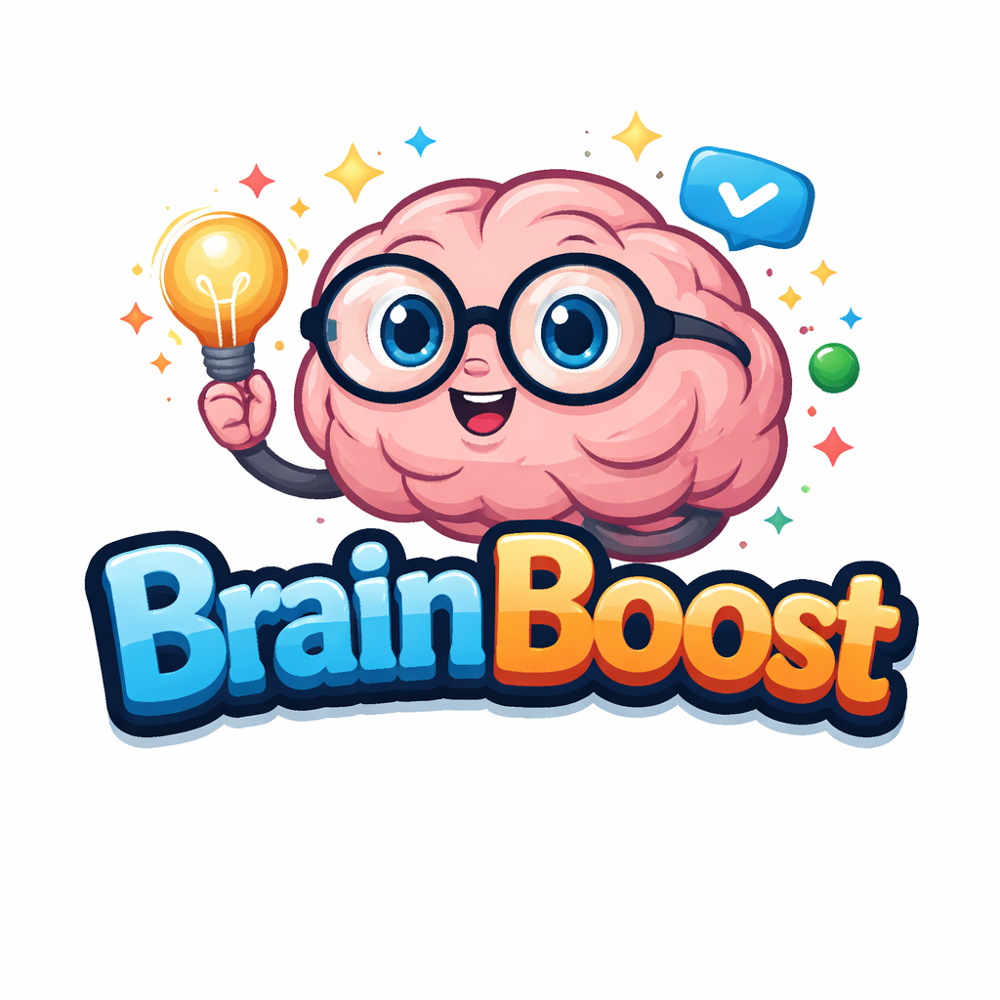
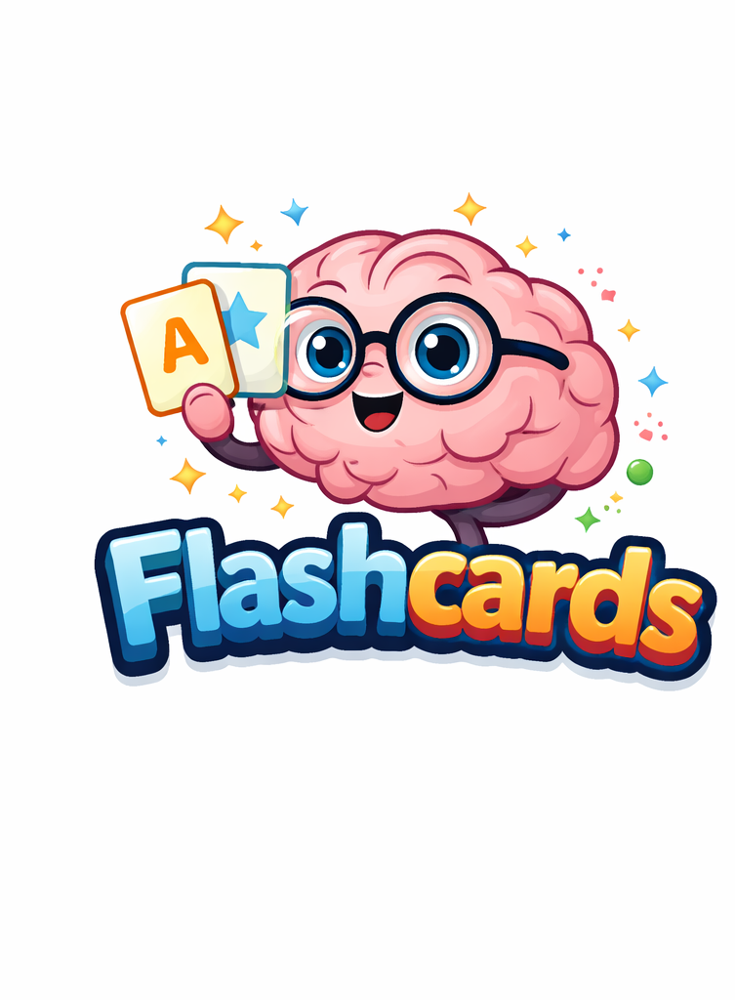

<p align="center">
  
</p>

<h1 align="center">🧠 Brain Boosters</h1>

<p align="center">
  A learning platform for practicing Math, Geography, and Science through flashcards and timed quizzes.
</p>

---

## 📖 About

**Brain Boosters** (BrainBoost) is a learning platform dedicated to helping students strengthen their understanding of math, science, and geography through clear explanations, engaging resources, and practical study tools. Whether reviewing core concepts or prepping for an exam, Brain Boosters gives learners a simple space to practice and build confidence.

## ✨ Features

- 📚 Three subject areas: **Math**, **Geography**, and **Science**
- 🗂️ Flashcards for quick review of each subject
- ⏱️ Timed practice quizzes with a start-quiz countdown
- ❌ Incorrect answers highlighted in red on submission
- 🔁 Retake any quiz as many times as you'd like
- 🧭 Consistent nav bar across every page for easy switching between subjects

## 🖼️ Visuals

<p align="center">
  
  
</p>

<p align="center">
  
</p>

## 🛠️ Built With

- **HTML** — page structure
- **CSS** — styling (`css/style_sheet.css`, `css/overlay.css`)
- **JavaScript** — quiz logic, flashcard rendering, and page behavior

## 📁 Project Structure

```
brain-boosters/
├── home.html
├── math.html
├── math_flash.html
├── math_quiz.html
├── geography.html
├── geography_flash.html
├── geography_quiz.html
├── science.html
├── science_flash.html
├── science_quiz.html
├── css/
│   ├── style_sheet.css
│   └── overlay.css
├── js/
│   ├── home.js
│   ├── lastModified.js
│   ├── mathF.js
│   ├── mathQ.js
│   ├── geographyQ.js
│   └── scienceQ.js
└── images/
    ├── logo.png
    ├── hackers.png
    ├── flash.png
    └── quiz.png
```

## 🚀 Getting Started

No build tools or dependencies needed — it's plain HTML/CSS/JS.

1. Clone the repo:
   ```bash
   git clone https://github.com/your-username/brain-boosters.git
   ```
2. Open the project folder:
   ```bash
   cd brain-boosters
   ```
3. Open `home.html` in your browser to get started.

## 🧭 How It Works

- **Home** — landing page with an "About Us" section and navigation to each subject.
- **Subject pages** (`math.html`, `geography.html`, `science.html`) — each links out to that subject's flashcards and quiz.
- **Flashcard pages** — quick-review cards per subject.
- **Quiz pages** — click **Start Quiz** to begin a timed quiz; submit to see incorrect answers marked in red; retake as many times as you like.

## 🗺️ Roadmap

- [ ] Add more subjects and question sets
- [ ] Track quiz scores over time
- [ ] Add difficulty levels
- [ ] Shuffle flashcards / questions on each attempt

## 👥 Built By

- **Blimi Swiatycki** — [@bswiatyc2](https://github.com/bswiatyc2)
- **Ahuva Schechter** — [@AhuvaSchechter](https://github.com/AhuvaSchechter)
- **Tamar Zelokovitch** — [@tamzel](https://github.com/tamzel)

---

<p align="center">Made with 🧠 by the Brain Boosters team.</p>
